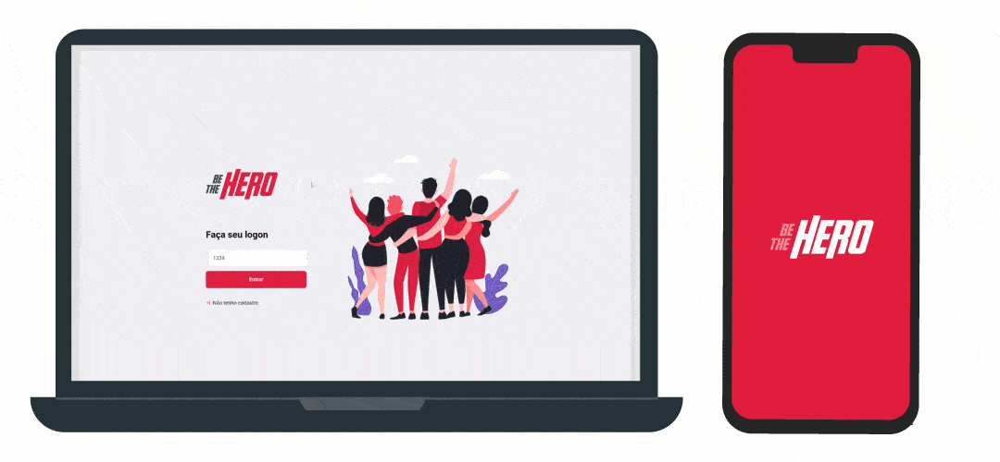

<h1 align="center">
    
</h1>
<h4 align="center">
  Project developed during 🚀<b>Semana OmniStack 11.0</b>
</h4>

### 🎨 Preview

<h1 align="center">
    
</h1>

### 💾 Technologies

- [Node.js](https://nodejs.org/en/) 
- [React](https://reactjs.org)
- [React Native](https://reactnative.dev/) 

### ⚙️ How it works

#### Be The Hero aims to connect NGOs with people that want to donate via a mobile app.

NGO's can create an account in the app as shown in preview and start posting individual cases or general things that help is needed. Then, in the mobile app, anyone can download and see all the cases and NGOs avaliable to help right away; clicking in details and selecting either Whatsapp or E-mail the person can contact the NGO directly.

## [Contact me](https://www.linkedin.com/in/guerrero-roberto/)

